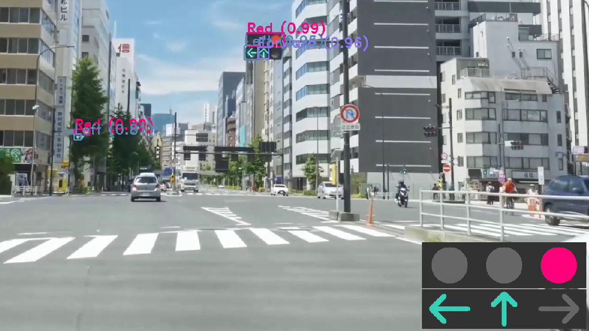
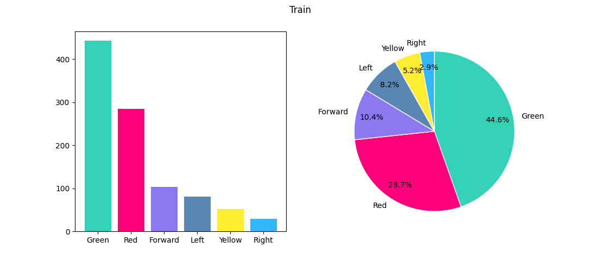
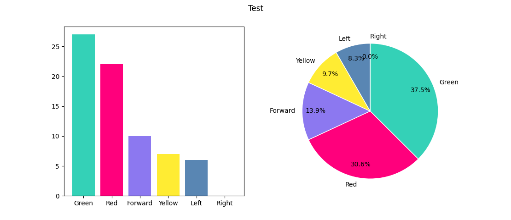
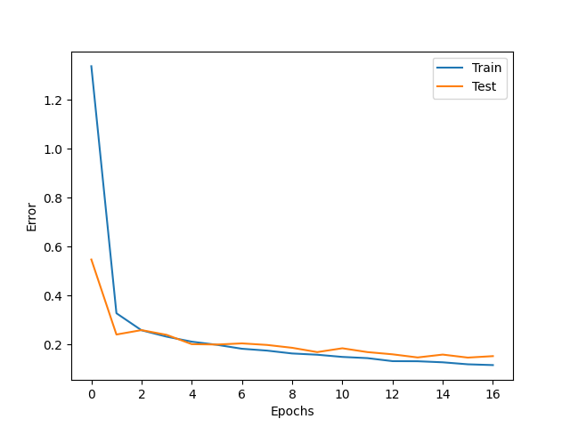
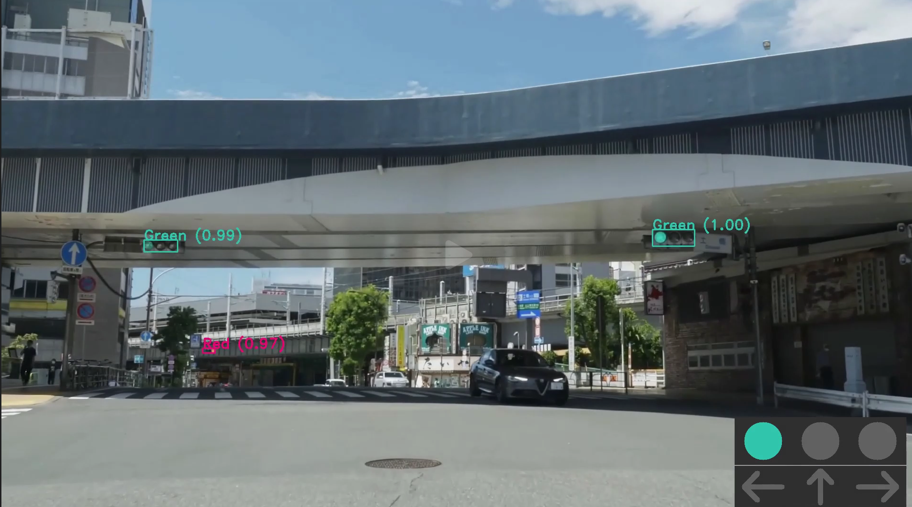

# 信号機検出
信号機を検出し、画面右下に認識結果を表示します。

## 使用した技術
- Pytorch
- Faster R-CNN

物体検出の代表的なモデルである Faster R-CNN を勉強したので、理解を深めるために実際に使用してみました。

## 実行例
YouTubeに1分程度のデモ動画をアップロードしています。 
https://youtu.be/RZgY4dEtYw8

 

# 学習
## 学習データ
学習データはYouTube動画をスクショして集めました。 
- Train: 420枚
- Test: 31枚

↓ データセットの分析結果です。（analyze_dataset.pyを使用） 

## 学習結果

 

# 認識
- 閾値0.7を超えるボックスのみを表示しています。
- 手前の信号機を読み取るために、ボックスの面積を計算して最大のものを採用しています。

    